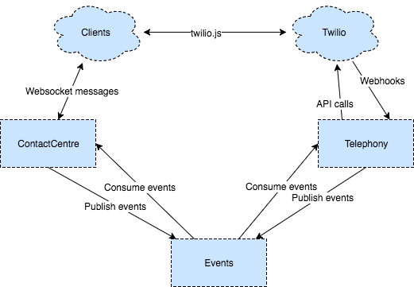

# Talkbox

A proof of concept in building browser-based telephony applications using functional programming languages. The back-end is implemented with [Elixir](http://elixir-lang.org/), the front-end implemented with [Elm](http://elm-lang.org/).

## Why?

To improve my knowledge of functional programming. To learn what types of problems are more/less difficult to solve in the telephony domain using functional languages vs. object oriented languages.

## What does it do?

- [x] Make a call from the browser
- [x] Receive a call from another browser
- [x] Make a conference call
- [ ] Receive a call from a telephone

## Design

This project serves as an [umbrella](https://elixirschool.com/lessons/advanced/umbrella-projects/) enclosing many smaller applications.

### Goals

- Small, loosely coupled components, each with a narrow set of responsibilities
- Components that can be tested in isolation

### Components

Each of these components is implemented as a child-project under the `/apps` directory. This was done to promote the abovementioned design goals.



- **[UI](apps/ui)** Serves the single page web application. Translates websocket messages from the client into [events](apps/events). Provides an endpoint for other applications (i.e. [router](apps/router)) to send websocket messages back to the client.
- **[Callbacks](apps/callbacks)** Accepts webhook requests from Twilio. Responds back with TwiML instructions and/or publishes [events](apps/events) to broadcast that call state in Twilio has changed.
- **[Telephony](apps/telephony)** Manages the core business logic for the system. Maintains its own version of the call state separate from Twilio.
- **[Router](apps/router)** Handlers for [events](apps/events). Runs a pool of consumer processes that pull events from the event queue and delegate to the [telephony](apps/telephony) or [ui](apps/ui) applications.
- **[Events](apps/events)** Contains event definitions used to communicate between applications and facilitates publishing of events

## Set up

1. Install dependencies
    ```
    brew bundle
    ```
1. Set environment variables
    ```
    export TWILIO_ACCOUNT_SID=<account sid>
    export TWILIO_AUTH_TOKEN=<auth token>
    ```
1. Run the tests
    ```
    mix test
    ```
1. Start the applications
    ```
    iex -S mix phoenix.server
    ```
1. Open the application
    ```
    open http://localhost:5000/?client_name=yourname
    ```

## Proposed enhancements

- [ ] Resilience to client crash (fetch state from server at load)
- [ ] Resilience to server crash (fetch call state from Twilio at boot)
- [ ] Rolling deploys (proposing Docker with Consul)
